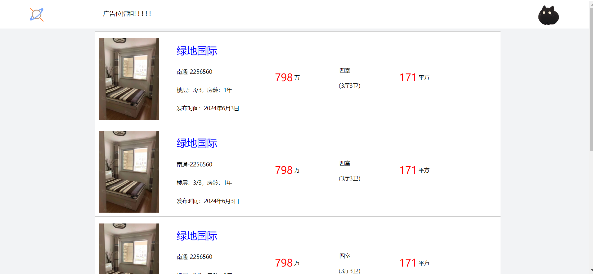
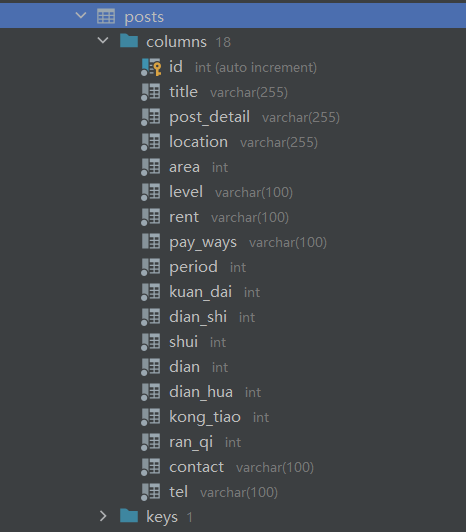

FNTongCheng的意思解释

F: Five

N:Nine

也就是59同城，一个仿58同城发布二手房信息的个人练习网站项目

测试github更新后的push

# 部署云服务器相关

前端部分，上传时仅上传打包后的web即可。

## 前端文件说明

`fntongcheng_pc`为本地开发版本使用的接口均为本地环回网络地址

`fntongcheng_pc_Vx`为项目正式部署在服务器中的版本，使用的接口均为服务器地址的接口

`web`：最终用于部署在云服务器中vue3打包文件

## 后端文件说明

# 开发相关说明

## 测试帐号

帐号：vale

密码：123456

## 发布信息

整租，厂房，商铺

出租发布，求租发布

### 内容

| 字段              | 数据类型 | 单位                | 备注     |
| ----------------- | -------- | ------------------- | -------- |
| 标题              | char     |                     |          |
| 详细介绍          | char     |                     |          |
| 所在区域          | char     |                     |          |
| 面积              | char     | 平方米              |          |
| 楼层（单层/多层） | char     |                     |          |
| 租金              |          | 元/$m^2$/天， 元/月 |          |
| 支付方式          |          | 付x月，押X月        |          |
| 起租期            | number   | 月                  |          |
| 宽带              | number   |                     | 0无，1有 |
| 有线电视          | int      |                     |          |
| 水                | int      |                     |          |
| 电                | int      |                     |          |
| 电话              | int      |                     |          |
| 空调              | int      |                     |          |
| 燃气              | int      |                     |          |
| 联系人            | char     |                     |          |
| 联系电话          | char     |                     |          |

